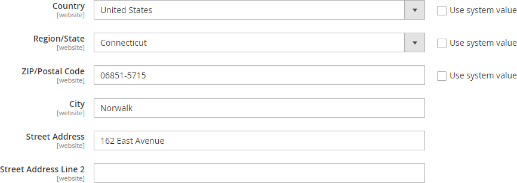
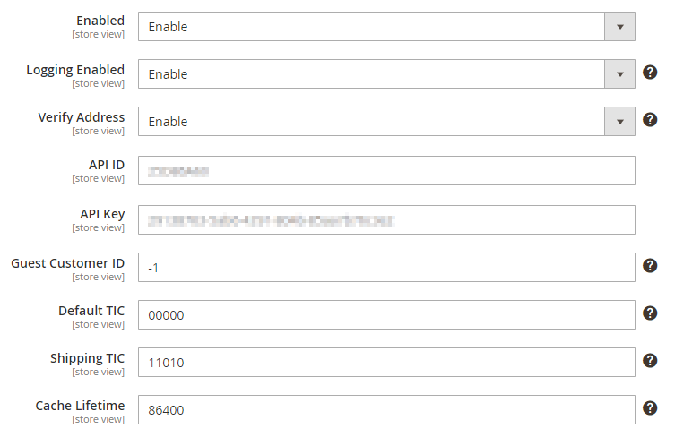
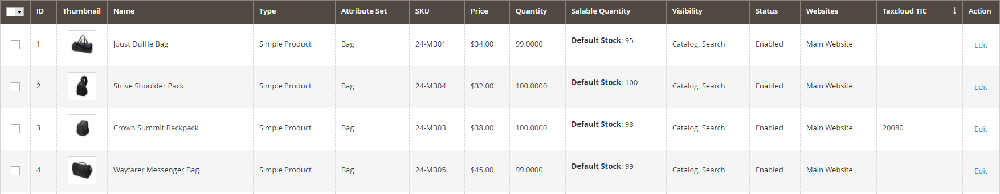
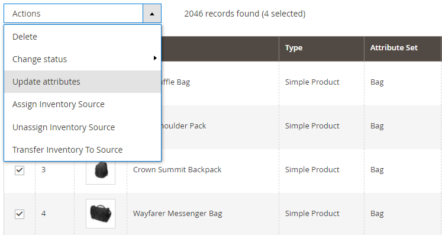
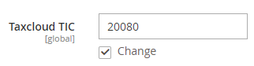
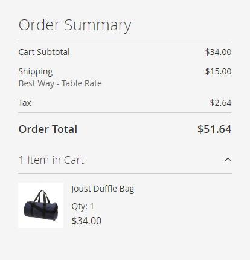
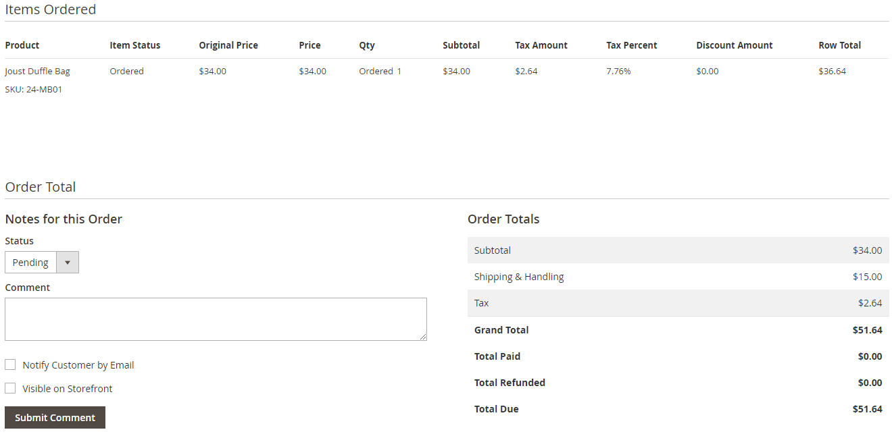
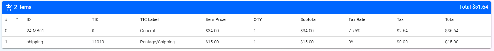
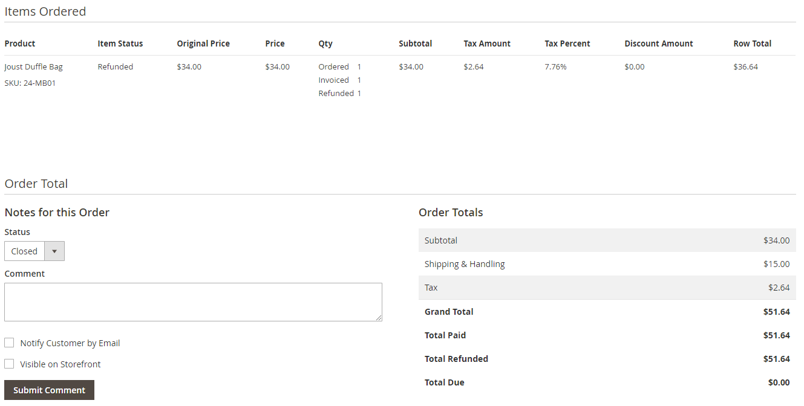
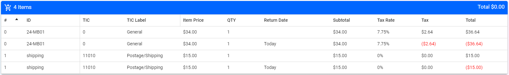

# TaxCloud for Magento 2
> Sales Tax at the Speed of Commerce

## Compatibility

**Adobe Commerce 2.4.8-p1 Compatible** ✅  
This extension (Version 1.0.0) has been tested and verified to work with Adobe Commerce 2.4.8-p1 (released June 10th, 2025).

**Supported Versions:**
- Adobe Commerce 2.4.x
- Adobe Commerce 2.4.8-p1 ✅
- Magento Open Source 2.4.x

##### How It Works
TaxCloud is the Internet's most affordable sales tax compliance service with a state-paid option from 25 member states - because the states paying us lets us give back to you. Working closely with states allows TaxCloud to offer industry leading tax data, automated filing options, the lowest prices and best value for your business's transactions in the USA.

**Calculate** - We determine the applicable sales tax rate based on product and service taxability.

**Collect** - Sales tax is collected at the time of transaction on your site when your customers checkout.

**File** - We can file returns and remit your collected sales tax proceeds to the appropriate state and local jurisdictions.

**Audit-Ready** - We can support you with any state-issued notices or audit inquiries.

[Learn more](https://taxcloud.com/)

## Installing the TaxCloud Module

### Step 1: Create a TaxCloud Account

[Create your TaxCloud account](https://taxcloud.com/) and select either Core or Enhanced services. New accounts are granted a free testing period to make sure your Magento store integrates properly.

### Step 2: Configure your TaxCloud Account

Now that you have created your TaxCloud account, there are a few important matters to take care of. Please log in to your TaxCloud account and complete all of the items below.

1. **Add your website.** While logged in, go to *Settings → Stores*. If your store is not listed on this page, you will need to add it by clicking *Add Store* and following the on-screen prompt.
1. **Add business locations.** If your business has a physical presence in the United States, it is imperative that you register your business locations, including stores, warehouses, and distribution facilities, with TaxCloud. To do so, navigate to *Settings → Locations* and click *Add Location.*
1. **Select your tax states.** Navigate to *Settings → Tax States*. You will be presented with a map of the United States. Click the map to highlight those states where you would like to collect sales tax.

### Step 3: Install the Magento 2 Module

#### Manual Installation

Download the extension as a ZIP file from the [releases page](https://github.com/FedTax/Magento2/releases/latest). Unzip the archive and place at `app/code/Taxcloud/Magento2` on your webserver. Then run the following commands from your Magento 2 root directory.

```
bin/magento setup:upgrade
bin/magento setup:di:compile
```

#### Install via Composer

```
{
    "repositories": [
        {
            "url": "https://github.com/FedTax/Magento2.git",
            "type": "git"
        }
    ],
    "require": {
        "taxcloud/magento2": "*"
    }
}
```

## Development

### Contributing

1. Fork the repository and create a feature branch
2. Make your changes and test them in a Magento installation
3. Submit a pull request

**Note:** Tests run automatically on pull requests via GitHub Actions.

### Running Tests

```bash
# Run all tests using Docker (recommended)
make test

# Run all tests locally (requires PHP)
make test-local

# Or run individual tests
./run-test.sh
php Test/Integration/PostalCodeParserTest.php
```

## Configuring the TaxCloud Module

After installing the module, there are a few important configuration options you must set in the Magento 2 admin dashboard.

#### Shipping Origin Settings

Navigate to *Stores → Configuration* and then *Sales → Shipping Settings*.



It is very important to enter the full shipping origin address for accurate sales tax calculation. Ensure that you enter the full Zip+4 code.

#### TaxCloud Settings

Navigate to *Stores → Configuration* and then *Sales → Tax*.



* **Enabled** - Select `Enabled` in order to enable the TaxCloud module.
* **Logging Enabled** - Useful for debugging and testing, select `Enabled` in order to log all TaxCloud API calls into `var/log/taxcloud.log`. Make sure to set up log rotation if you keep this option enabled during production!
* **Verify Address** - Select `Enabled` to turn on TaxCloud's address verification API calls. You may want to disable this if you have another module that validates shipping addresses.
* **API ID** - Enter your API ID from your TaxCloud account.
* **API Key** - Enter your API Key from your TaxCloud account.
* **Guest Customer ID** - Enter the customer ID to send to TaxCloud during a guest checkout. Unless there is a special reason to change this for your store, use the default value of `-1`.
* **Default TIC** - Enter the Taxability Information Code you would like to use for products where an explicit TIC has not been specified.
* **Shipping TIC** - Enter the Taxability Information Code you would like to use for shipping costs. Use `11010` if you charge only postage, and `11000` for shipping & handling.
* **Cache Lifetime** - Enter the amount of time in seconds you would like to cache the sales tax lookup and verify address API calls. The default value is `86400` (24 hours), or enter `0` to disable caching for development purposes.

#### Product Settings

If applicable, you should set a Taxability Information Code per product. Navigate to *Catalog → Products*.



From the main product grid, you will be able to see and sort by each product's TIC. In order to edit a TIC, click on the *Edit* link for a specific product.


There are two main fields you should properly set per product.

* **Tax Class** - In most cases, you should select `Taxable Goods` for this, even if the product you are selling may be tax exempt under certain, or all, circumstances. If you select `None`, then this product will never be sent to TaxCloud's API during checkout. ___It is strongly discouraged to select `None`___ as you will not have an audit trail of the sale of this item in your TaxCloud account!
* **Taxcloud TIC** - The five digit Taxability Information Code for this product. For more information, see [Taxability Information Codes](https://taxcloud.com/tic).

##### Bulk Updating

To bulk update product TICs, navigate to *Catalog → Products*.



Select the checkbox next to the items you want to update, then click *Actions → Update attributes*.



Find the Taxcloud TIC textbox and click the *Change* checkbox below it. Enter a new TIC and click *Save*.

#### Customer Settings

If you have tax exempt customers, you can add an exemption certificate ID per user. Currently, there is no method to create an exemption certificate through the Magento 2 module, but if you have an existing exemption certificate in TaxCloud, you can link it to a customer's profile.

Navigate to *Customers → All Customers*, click on the *Edit* link for a specific customer, and then click on *Account Information*.


Here you can add the 36 character plus dashes UUID for the already existing exemption certificate.

## Testing the TaxCloud Module

At this point, the TaxCloud module should be fully configured. However, it is very important to test the integration before going live. This module has been tested with stock Magento, but your store may have other modules that could interfere or cause unintended consequences with the TaxCloud module.

#### Sales Tax Calculation During Checkout

Test adding an item to your cart, clicking *Proceed to Checkout*, entering a shipping address, and selecting a shipping option. At this point, you should verify that the calculated tax is accurate. Retry this process with each product type / TIC you sell through your store, and combinations of product types / TICs.



Note that on the shopping cart page, before the customer has entered their shipping address, sales tax will not be calculated unless the customer has started the checkout process and returned to the shopping cart page.

#### Order Completion

Test completing an order and comparing the results to your TaxCloud dashboard. The tax percentages may be slightly different on the Magento side due to rounding, but the tax amounts should match exactly. Make sure the correct TICs, quantities, and other fields are correct on the TaxCloud dashboard.





#### Order Refund

Test creating a credit memo for an order and comparing the results to your TaxCloud dashboard. The TaxCloud Magento 2 module supports both partial and total refunds.





##### How Refunds Work

When a credit memo is refunded in Magento, the extension automatically processes the refund through TaxCloud's API. Here's how the refund flow works:

1. **Event Trigger**: When a credit memo is refunded, Magento fires the `sales_order_creditmemo_refund` event, which is observed by `Taxcloud\Magento2\Observer\Sales\Refund`.

2. **Refund Processing**: The observer calls `returnOrder()` method in the API model, which:
   - Extracts all items from the credit memo (products and shipping)
   - Builds cart items array with product details (SKU, TIC, Price, Quantity)
   - Calculates item prices accounting for discounts
   - Adds shipping as a separate cart item if shipping is being refunded
   - Prepares API parameters including the order ID and returned date

3. **Event Hooks**: Before making the API call, the `taxcloud_returned_before` event is dispatched, allowing you to modify refund parameters. After the API call, `taxcloud_returned_after` is dispatched, allowing you to modify the response.

4. **TaxCloud API Call**: The extension makes a SOAP call to TaxCloud's `Returned` API with retry logic for reliability.

5. **Response Validation**: The response is validated to ensure the refund was processed successfully.

**Key Features:**
- Supports both partial and full refunds
- Handles product items and shipping separately
- Calculates prices with discounts applied
- Uses Taxability Information Codes (TIC) for accurate tax processing
- Includes retry logic for API failures
- Provides event hooks for extension customization
- Ensures all required parameters are present for API calls

## Extending the TaxCloud Module

In certain cases, a store owner may need to extend this module. Specific use cases might include: needing to adjust the shipping cost for a shipment containing both taxable and non-taxable items, fetching exemption certificates from an external source, or changing the shipping origin for multi-warehouse fulfillment.

Each of these situations can be accomplished using an event observer. For every API call to TaxCloud, this module emits a before and after event. The before events can be used to modify the parameters sent to TaxCloud's API, and the after events can be used to modify the response.

**Capture on payment:** Orders are sent to TaxCloud when the order is **captured** (first invoice paid), not when the order is placed. Canceled orders never reach TaxCloud, avoiding the need for void/refund workarounds (TaxCloud has no native "Canceled" state). This aligns with a capture-on-payment/fulfillment flow used on other platforms.

| Event Name | Description | Data Objects |
| ----- | ---- | --- |
| `taxcloud_lookup_before` | Emitted before the `Lookup` call to get tax rates | `$params`, `$customer`, `$address`, `$quote`, `$itemsByType`, `$shippingAssignment` |
| `taxcloud_lookup_after` | Emitted after the `Lookup` call to get tax rates | `$result`, `$customer`, `$address`, `$quote`, `$itemsByType`, `$shippingAssignment` |
| `taxcloud_verify_address_before` | Emitted before the `VerifyAddress` call during checkout | `$params` |
| `taxcloud_verify_address_after` | Emitted after the `VerifyAddress` call during checkout | `$result` |
| `taxcloud_authorized_with_capture_before` | Emitted before the `AuthorizedWithCapture` call when an order is captured (invoice paid) | `$params`, `$order` |
| `taxcloud_authorized_with_capture_after` | Emitted after the `AuthorizedWithCapture` call when an order is captured (invoice paid) | `$result`, `$order` |
| `taxcloud_returned_before` | Emitted before the `Returned` call when a credit memo is created | `$params`, `$order`, `$items`, `$creditmemo` |
| `taxcloud_returned_after` | Emitted after the `Returned` call when a credit memo is created | `$result`, `$order`, `$items`, `$creditmemo` |


## Automated Deployment

This extension includes automated deployment to sandbox environments via GitHub Actions.

### Setup

1. **Configure GitHub Secrets** in your repository settings:
   - `SFTP_HOST`: Your sandbox server IP
   - `SFTP_USERNAME`: SSH username (e.g., `root` or `deploy`)
   - `SFTP_PORT`: SSH port (default: `22`)
   - `MAGENTO_ROOT_PATH`: Magento root directory (e.g., `/var/www/html`)
   - `WEB_USER`: Web server user (e.g., `www-data`)
   - `WEB_GROUP`: Web server group (e.g., `www-data`)
   - `SSH_PRIVATE_KEY`: Private SSH key for server access

2. **Generate SSH Key** (if needed):
   ```bash
   ./scripts/setup-ssh-deployment.sh
   ```

### Deployment

- **Automatic**: Push to `main`, `develop`, or `DEV-*` branches
- **Manual**: Go to Actions → Deploy to Sandbox → Run workflow

The deployment process will:
- Run all integration tests
- Deploy module files via SFTP
- Execute Magento setup commands
- Verify deployment success

## License

[](https://opensource.org/licenses/OSL-3.0)

This project is distributed under the Open Software License ("OSL") v. 3.0 (see the LICENSE file in the project root).
