# TaxCloud for Magento 2
> Sales Tax at the Speed of Commerce

## Compatibility

**Adobe Commerce 2.4.8-p1 Compatible** ✅  
This extension (Version 1.3.0) has been tested and verified to work with Adobe Commerce 2.4.8-p1 (released June 10th, 2025).

**Supported Versions:**
- Adobe Commerce 2.4.x
- Adobe Commerce 2.4.8-p1 ✅
- Magento Open Source 2.4.x

##### How It Works
TaxCloud is the Internet's most affordable sales tax compliance service with a state-paid option from 25 member states - because the states paying us lets us give back to you. Working closely with states allows TaxCloud to offer industry leading tax data, automated filing options, the lowest prices and best value for your business's transactions in the USA.

**Calculate** - We determine the applicable sales tax rate based on product and service taxability.

**Collect** - Sales tax is collected at the time of transaction on your site when your customers checkout.

**File** - We can file returns and remit your collected sales tax proceeds to the appropriate state and local jurisdictions.

**Audit-Ready** - We can support you with any state-issued notices or audit inquiries.

[Learn more](https://taxcloud.com/)

## Installing the TaxCloud Module

### Step 1: Create a TaxCloud Account

[Create your TaxCloud account](https://taxcloud.com/) and select either Core or Enhanced services. New accounts are granted a free testing period to make sure your Magento store integrates properly.

### Step 2: Configure your TaxCloud Account

Now that you have created your TaxCloud account, there are a few important matters to take care of. Please log in to your TaxCloud account and complete all of the items below.

1. **Add your website.** While logged in, go to *Settings → Stores*. If your store is not listed on this page, you will need to add it by clicking *Add Store* and following the on-screen prompt.
1. **Add business locations.** If your business has a physical presence in the United States, it is imperative that you register your business locations, including stores, warehouses, and distribution facilities, with TaxCloud. To do so, navigate to *Settings → Locations* and click *Add Location.*
1. **Select your tax states.** Navigate to *Settings → Tax States*. You will be presented with a map of the United States. Click the map to highlight those states where you would like to collect sales tax.

### Step 3: Install the Magento 2 Module

#### Manual Installation

Download the extension as a ZIP file from the [releases page](https://github.com/FedTax/Magento2/releases/latest). Unzip the archive and place at `app/code/Taxcloud/Magento2` on your webserver. Then run the following commands from your Magento 2 root directory.

```
bin/magento setup:upgrade
bin/magento setup:di:compile
```

#### Install via Composer

```
{
    "repositories": [
        {
            "url": "https://github.com/FedTax/Magento2.git",
            "type": "git"
        }
    ],
    "require": {
        "taxcloud/magento2": "*"
    }
}
```

### Uninstalling the Module

Installing the module adds two EAV attributes via the `InstallTaxcloudData`
data patch:

- `taxcloud_tic` on products (the TaxCloud TIC), and
- `taxcloud_cert` on customers (the exemption certificate ID).

The patch is revertable (`InstallTaxcloudData` implements
`PatchRevertableInterface`), so these attributes are cleaned up automatically
when the module is uninstalled. Magento invokes the patch's `revert()` from the
uninstall-data flow:

```
bin/magento module:uninstall Taxcloud_Magento2
```

(`module:uninstall` applies to Composer-installed modules; it runs the data
patch's `revert()` before removing the module's files.)

Reverting drops both attributes (and, because EAV value storage cascades on the
attribute, any TIC/certificate values stored against products and customers).
Re-installing and running `bin/magento setup:upgrade` re-applies the patch and
recreates the attribute definitions — but not the previously stored values — so
revert is a destructive, one-way cleanup. It only runs on uninstall.

## Development

### Contributing

1. Fork the repository and create a feature branch
2. Make your changes and test them in a Magento installation
3. Submit a pull request

**Note:** Tests run automatically on pull requests via GitHub Actions.

### Running Tests

Unit tests run with the PHPUnit and Magento classes of the Magento
installation this module lives inside — the module has no `vendor/` of its
own. With the module checked out at `app/code/Taxcloud/Magento2/`:

```bash
make test-unit                          # or: make test
make test-unit MAGENTO_ROOT=/path/to/magento   # explicit install root
```

In CI, unit tests run on every push/PR against a matrix of Magento
versions (see `.github/workflows/test.yml`).

Integration tests live in their own pipeline — they boot the full Magento
application against a real database and run via PHPUnit. They are expensive
and run on demand (or on release tags), not on every push. See
[docs/INTEGRATION_TESTS.md](docs/INTEGRATION_TESTS.md) for the 5-minute
local setup and the matrix of supported editions/versions.

### Coding standard

This module is linted against the **`Magento2`** ruleset from
[magento/magento-coding-standard](https://github.com/magento/magento-coding-standard),
pinned to `^40`. It replaces the PSR-2 gate this repo used to run — PSR-2 was
deprecated in 2019 — and adds the Magento-specific checks that a generic PHP
standard has no opinion on: short array syntax, constant visibility, discouraged
functions, proxies/interceptors requested in constructors, legacy `Mage`
entities, and Magento's PHPDoc conventions.

The ruleset, the scanned paths and the deferrals all live in
`[phpcs.xml.dist](phpcs.xml.dist)`, which both CI and `make lint` run with no
arguments, so the two cannot drift:

```bash
make lint       # run the standard (uses the Magento install's phpcs)
make lint-fix   # auto-fix what phpcbf can (short arrays, whitespace, imports)
```

Two things are worth knowing before changing this setup:

- **The `Magento2` standard reports findings as warnings, not errors.** Nothing it
  reports on this module is an error, so the gate deliberately fails on *any*
  finding, via `phpcs`'s exit code. The previous job grepped stdout for `"ERROR"`,
  which against this ruleset could never have failed — a green build would have
  meant nothing.
- **`Magento2` is not a superset of PSR-12.** It cherry-picks PSR-1/PSR-2 sniffs and
  exactly one PSR-12 sniff (`PSR12.Properties.ConstantVisibility`). It was adopted
  on its own here for the Magento-specific coverage; that choice trades away
  PSR-12's stricter whitespace, import and control-structure sniffs. Adding
  `<rule ref="PSR12"/>` alongside it is viable but not free — the two standards
  configure some shared Squiz sniffs with conflicting properties
  (`ignoreBlankLines`, `equalsSpacing`), so whichever is included last silently
  wins.

Some sniffs are deferred rather than satisfied, in the same tactical spirit as
`[phpstan-baseline.neon](phpstan-baseline.neon)`, to burn down during the REST
migration. Each carries its rationale inline in `phpcs.xml.dist`; the largest is
`Magento2.Annotation` (PHPDoc formatting, redundant with the native PHP 8.2 types
already on the signatures). Deferrals are scoped to a specific file wherever the
findings are confined to one, so new code is still held to the rule.

Static analysis runs separately, via PHPStan at level 5 — see
`[phpstan.neon](phpstan.neon)` and `make phpstan`.

## Configuring the TaxCloud Module

After installing the module, there are a few important configuration options you must set in the Magento 2 admin dashboard.

#### Shipping Origin Settings

Navigate to *Stores → Configuration* and then *Sales → Shipping Settings*.

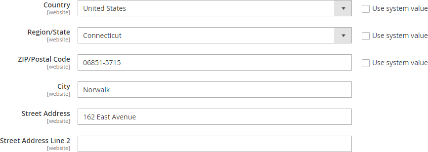

It is very important to enter the full shipping origin address for accurate sales tax calculation. Ensure that you enter the full Zip+4 code.

#### TaxCloud Settings

Navigate to *Stores → Configuration* and then *Sales → Tax*.

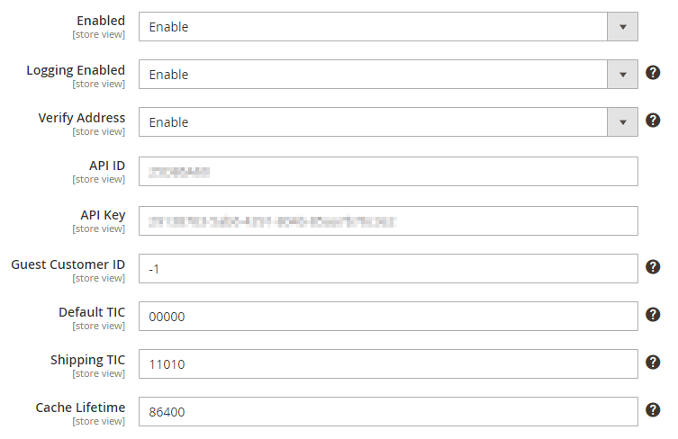

* **Enabled** - Select `Enabled` in order to enable the TaxCloud module.
* **Logging** - Writes TaxCloud activity to `var/log/taxcloud.log`. Three modes:
  * `Enable - Basic` - lifecycle events, decisions and errors: which observers ran, which API operations were called, cache hits, early exits (invalid ZIP, non-US address, …) and every warning/error. Enough to confirm the extension works and events trigger, at low log volume. This is the mode pre-existing installs land on after upgrading from the old `Enabled` value.
  * `Enable - Advanced` - everything in Basic, plus debug-level detail for support and troubleshooting: the full API request/response payloads, the raw SOAP request/response XML and HTTP headers as sent over the wire, per-call timing, and cache/context detail. Make sure to set up log rotation if you keep this mode enabled in production!
  * `Disable` - no TaxCloud logging.

  In every mode your TaxCloud `apiLoginID` and `apiKey` are redacted: the field names still appear (in both the params dumps and the raw XML), but their values are replaced with `***REDACTED***` so credentials cannot be harvested from logs, backups, or log shippers (Datadog, Splunk, SIEM exports, etc.). The log file location is configurable — see [Changing the log file location](#changing-the-log-file-location).
* **Verify Address** - Select `Enabled` to turn on TaxCloud's address verification API calls. You may want to disable this if you have another module that validates shipping addresses.
* **API ID** - Enter your API ID from your TaxCloud account.
* **API Key** - Enter your API Key from your TaxCloud account.
* **Guest Customer ID** - Enter the customer ID to send to TaxCloud during a guest checkout. Unless there is a special reason to change this for your store, use the default value of `-1`.
* **Default TIC** - Enter the Taxability Information Code you would like to use for products where an explicit TIC has not been specified.
* **Shipping TIC** - Enter the Taxability Information Code you would like to use for shipping costs. Use `11010` if you charge only postage, and `11000` for shipping & handling.
* **Cache Lifetime** - Enter the amount of time in seconds you would like to cache the sales tax lookup and verify address API calls. The default value is `86400` (24 hours), or enter `0` to disable caching for development purposes.
* **WSDL Endpoint** - *Advanced.* The TaxCloud SOAP endpoint the module calls. Defaults to the production endpoint `https://api.taxcloud.net/1.0/TaxCloud.asmx?wsdl`; leave it alone unless TaxCloud support has directed you to a sandbox or staging endpoint. Clearing the field restores the production default. Because the setting is store-scoped, you can point a staging store at a sandbox endpoint while production keeps using the default. Note that tax lookups are cached by request payload, not by endpoint — if you switch endpoints while reusing the same API credentials, clear the TaxCloud cache type so results from the previous endpoint are not reused (see [Clearing the TaxCloud cache](#clearing-the-taxcloud-cache)).
* **Only do tax calculations without further Taxcloud integration** - Select `Enabled` to keep tax calculation running while sending nothing back to TaxCloud that records or reverses a sale. Lookup, address verification and exempt-certificate validation still happen, so the storefront charges the right tax; `AuthorizedWithCapture` (order capture), `Returned` (credit memos and canceled unpaid orders) and `OrderDetails` are all skipped. Useful for merchants that push orders to other systems (i.e. Quickbooks) that are themselves connected to TaxCloud, where a second push from Magento would report the same sale twice. Because the setting is store-scoped, you can run one store view calculation-only while another keeps the full integration. Defaults to `Disabled`. When enabled, **Capture in TaxCloud** is hidden — there is no capture left for it to schedule.
* **Capture in TaxCloud** - Choose when the order is sent to TaxCloud: *On order creation* (at checkout; default), *On payment* (when an invoice is paid; recommended to avoid canceled orders reaching TaxCloud), or *On shipment* (when a shipment is created). For online payment methods, "on creation" and "on payment" often fire together; the choice matters for offline payment or when you only want to report tax on fulfilled orders.

#### Product Settings

If applicable, you should set a Taxability Information Code per product. Navigate to *Catalog → Products*.

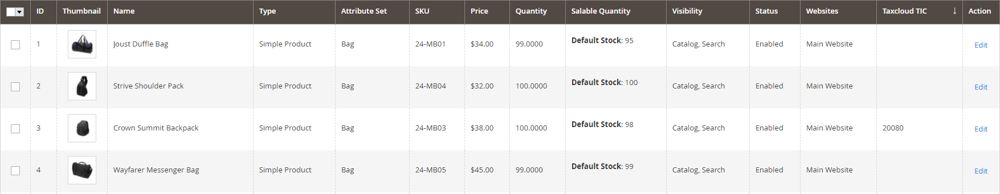

From the main product grid, you will be able to see and sort by each product's TIC. In order to edit a TIC, click on the *Edit* link for a specific product.

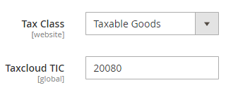

There are two main fields you should properly set per product.

* **Tax Class** - In most cases, you should select `Taxable Goods` for this, even if the product you are selling may be tax exempt under certain, or all, circumstances. If you select `None`, then this product will never be sent to TaxCloud's API during checkout. ___It is strongly discouraged to select `None`___ as you will not have an audit trail of the sale of this item in your TaxCloud account!
* **Taxcloud TIC** - The five digit Taxability Information Code for this product. For more information, see [Taxability Information Codes](https://taxcloud.com/tic).

##### Bulk Updating

To bulk update product TICs, navigate to *Catalog → Products*.

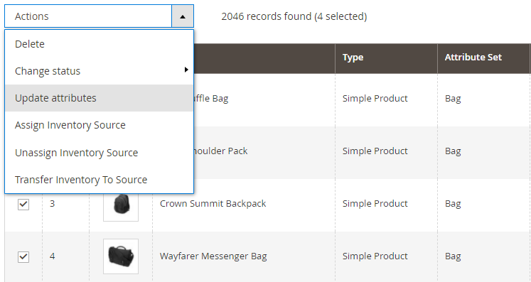

Select the checkbox next to the items you want to update, then click *Actions → Update attributes*.

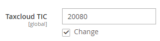

Find the Taxcloud TIC textbox and click the *Change* checkbox below it. Enter a new TIC and click *Save*.

#### Customer Settings

If you have tax exempt customers, you can add an exemption certificate ID per user. Currently, there is no method to create an exemption certificate through the Magento 2 module, but if you have an existing exemption certificate in TaxCloud, you can link it to a customer's profile.

Navigate to *Customers → All Customers*, click on the *Edit* link for a specific customer, and then click on *Account Information*.

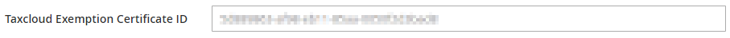

Here you can add the 36 character plus dashes UUID for the already existing exemption certificate.

##### Exemption certificate validation and caching

At checkout, the extension calls TaxCloud's `GetExemptCertificates` API to confirm that the linked certificate actually covers the destination state — a certificate registered for NY does not exempt a shipment to GA. The list of states covered by a certificate is cached **per (customer, certificate) for 1 hour** so that repeated checkouts do not call `GetExemptCertificates` on every page load.

The trade-off is a propagation window: if a certificate is revoked or its covered-states list is edited in the TaxCloud dashboard, this extension may continue to apply the previous covered-states list to that customer's checkouts for up to one hour. Cache entries expire on their own; there is no admin action required, and the next request after expiry validates against TaxCloud and refreshes the cache. The "Cache Lifetime" admin setting controls the tax-lookup and address-verification caches separately and does **not** shorten this 1-hour exempt-states window. If you have just revoked or modified a certificate and need the change reflected at checkout immediately, clear the TaxCloud cache type — see [Clearing the TaxCloud cache](#clearing-the-taxcloud-cache).

## Testing the TaxCloud Module

At this point, the TaxCloud module should be fully configured. However, it is very important to test the integration before going live. This module has been tested with stock Magento, but your store may have other modules that could interfere or cause unintended consequences with the TaxCloud module.

#### Sales Tax Calculation During Checkout

Test adding an item to your cart, clicking *Proceed to Checkout*, entering a shipping address, and selecting a shipping option. At this point, you should verify that the calculated tax is accurate. Retry this process with each product type / TIC you sell through your store, and combinations of product types / TICs.

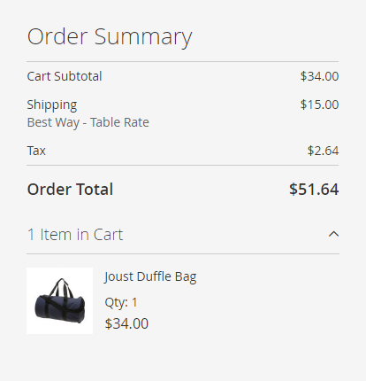

Note that on the shopping cart page, before the customer has entered their shipping address, sales tax will not be calculated unless the customer has started the checkout process and returned to the shopping cart page.

#### Order Completion

Test completing an order and comparing the results to your TaxCloud dashboard. The tax percentages may be slightly different on the Magento side due to rounding, but the tax amounts should match exactly. Make sure the correct TICs, quantities, and other fields are correct on the TaxCloud dashboard.

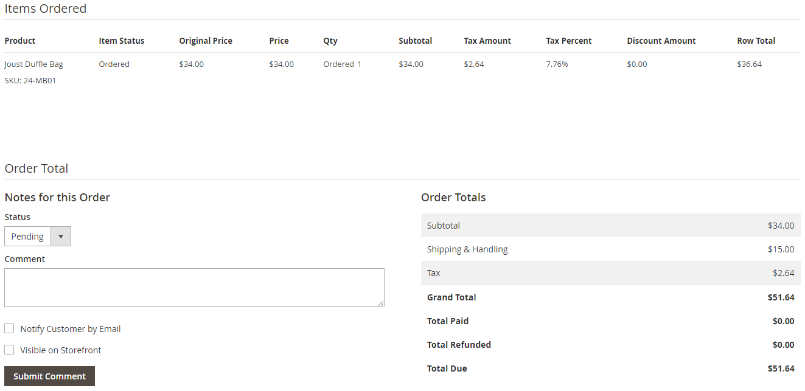

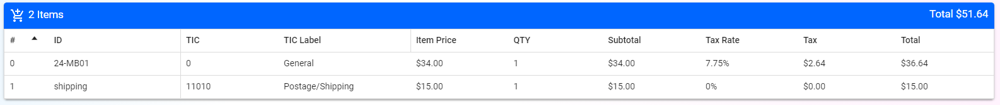

#### Order Refund

Test creating a credit memo for an order and comparing the results to your TaxCloud dashboard. The TaxCloud Magento 2 module supports both partial and total refunds.

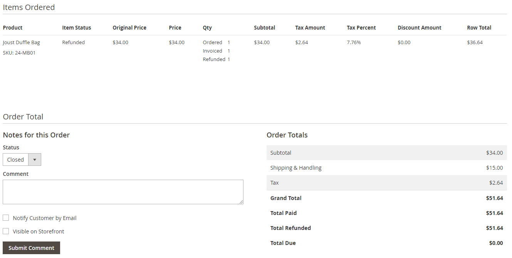

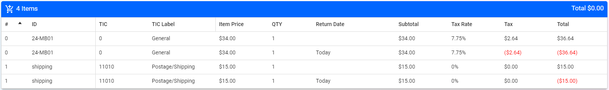

##### How Refunds Work

When a credit memo is refunded in Magento, the extension automatically processes the refund through TaxCloud's API. Here's how the refund flow works:

1. **Event Trigger**: When a credit memo is refunded, Magento fires the `sales_order_creditmemo_refund` event, which is observed by `Taxcloud\Magento2\Observer\Sales\Refund`.

2. **Refund Processing**: The observer calls `returnOrder()` method in the API model, which:
   - Extracts all items from the credit memo (products and shipping)
   - Builds cart items array with product details (SKU, TIC, Price, Quantity)
   - Calculates item prices accounting for discounts
   - Adds shipping as a separate cart item if shipping is being refunded
   - Prepares API parameters including the order ID and returned date

3. **Event Hooks**: Before making the API call, the `taxcloud_returned_before` event is dispatched, allowing you to modify refund parameters. After the API call, `taxcloud_returned_after` is dispatched, allowing you to modify the response.

4. **TaxCloud API Call**: The extension makes a SOAP call to TaxCloud's `Returned` API with retry logic for reliability.

5. **Response Validation**: The response is validated to ensure the refund was processed successfully.

**Key Features:**
- Supports both partial and full refunds
- Handles product items and shipping separately
- Calculates prices with discounts applied
- Uses Taxability Information Codes (TIC) for accurate tax processing
- Includes retry logic for API failures
- Provides event hooks for extension customization
- Ensures all required parameters are present for API calls

#### Order Cancellation (Unpaid Orders)

When an order is canceled before any invoice is created, the extension automatically sends TaxCloud's `Returned` API so the sale is not reported. This ensures you do not remit tax on orders that were never paid (e.g. Check/Money Order, Bank Transfer, COD, or any order canceled with no invoice).

##### How Canceled Unpaid Orders Are Handled

1. **Cancellation detected**: The extension listens to `order_cancel_after` and, as a fallback, to `sales_order_save_after` when the order state changes to canceled (e.g. when a payment gateway uses `registerCancellation()`).

2. **Conditions**: Returned is only called when:
   - The order state is canceled (entire order canceled, not partial).
   - The order has no invoices (unpaid; refunds continue to use the credit memo flow).
   - The order was captured in TaxCloud. The extension records this locally (a `taxcloud_captured` flag set on the order when capture succeeds), so the cancel decision needs no extra API call. For legacy orders placed before that flag existed, the extension falls back to TaxCloud's **OrderDetails** API and calls Returned when the response includes a non-empty **CapturedDate**. `OrderDetails` is a license-gated API; when it is unavailable the fallback is skipped safely (the order is treated as not captured) rather than causing an error.

3. **TaxCloud API call**: The extension calls the `Returned` API for the full order (all items and shipping), using the same `taxcloud_returned_before` and `taxcloud_returned_after` events (with `creditmemo` null for cancellation).

4. **Refunds unchanged**: Orders that have been invoiced and then refunded via credit memo are not affected; they continue to use the refund flow described above.

**Note:** This behavior applies to all merchants. It is especially relevant if you use offline or deferred payment methods where orders can be created and later canceled before payment.

## Troubleshooting

### Clearing the TaxCloud cache

The extension stores its API responses — tax lookups, address verifications, and exemption-certificate state lists — in a dedicated **TaxCloud** cache type rather than the general application cache. It appears as its own row under *System → Cache Management*, alongside Configuration, Page Cache, and the rest.

This means TaxCloud entries can be cleared on their own:

* **Admin** — *System → Cache Management*, tick **TaxCloud**, choose *Refresh* from the Actions dropdown, and Submit.
* **CLI** — `bin/magento cache:clean taxcloud`

Both clear only TaxCloud entries; the configuration, block, and full-page caches are untouched, so clearing after a TaxCloud-side change no longer costs a site-wide cache warm-up. Conversely, `bin/magento cache:flush` still clears everything including TaxCloud.

Reach for this when:

* You changed a product's TIC, or origin/nexus settings, and want the next checkout to re-price immediately rather than serving a cached lookup.
* You revoked or edited an exemption certificate in the TaxCloud dashboard and need the change reflected at checkout before the 1-hour exempt-states window expires.
* You switched the **WSDL Endpoint** while keeping the same API credentials, so cached results from the previous endpoint could still be served.

Disabling the TaxCloud cache type entirely (*System → Cache Management → Disable*) stops all TaxCloud response caching regardless of the **Cache Lifetime** setting, which is useful when diagnosing whether a wrong tax figure is stale or freshly returned. Remember to re-enable it — every checkout will otherwise call TaxCloud.

A setup patch enables the type on `bin/magento setup:upgrade`, so no action is normally needed. Enabling writes to `app/etc/env.php`; if that file is read-only at deploy time — as it can be on Adobe Commerce Cloud or a pipeline deploy — the patch logs a warning instead of failing the upgrade, and the type stays disabled. Check with:

```
bin/magento cache:status
```

and enable it by hand if `taxcloud` shows as `0`:

```
bin/magento cache:enable taxcloud
```

## Extending the TaxCloud Module

In certain cases, a store owner may need to extend this module. Specific use cases might include: needing to adjust the shipping cost for a shipment containing both taxable and non-taxable items, fetching exemption certificates from an external source, or changing the shipping origin for multi-warehouse fulfillment.

Each of these situations can be accomplished using an event observer. For every API call to TaxCloud, this module emits a before and after event. The before events can be used to modify the parameters sent to TaxCloud's API, and the after events can be used to modify the response.

| Event Name | Description | Data Objects |
| ----- | ---- | --- |
| `taxcloud_lookup_before` | Emitted before the `Lookup` call to get tax rates | `$params`, `$customer`, `$address`, `$quote`, `$itemsByType`, `$shippingAssignment` |
| `taxcloud_lookup_after` | Emitted after the `Lookup` call to get tax rates | `$result`, `$customer`, `$address`, `$quote`, `$itemsByType`, `$shippingAssignment` |
| `taxcloud_verify_address_before` | Emitted before the `VerifyAddress` call during checkout | `$params` |
| `taxcloud_verify_address_after` | Emitted after the `VerifyAddress` call during checkout | `$result` |
| `taxcloud_authorized_with_capture_before` | Emitted before the `AuthorizedWithCapture` call (when the order is sent per "Capture in TaxCloud" setting) | `$params`, `$order` |
| `taxcloud_authorized_with_capture_after` | Emitted after the `AuthorizedWithCapture` call (when the order is sent per "Capture in TaxCloud" setting) | `$result`, `$order` |
| `taxcloud_returned_before` | Emitted before the `Returned` call when a credit memo is created or when a canceled unpaid order is reversed | `$params`, `$order`, `$items`, `$creditmemo` |
| `taxcloud_returned_after` | Emitted after the `Returned` call when a credit memo is created or when a canceled unpaid order is reversed | `$result`, `$order`, `$items`, `$creditmemo` |

For order cancellation, `$creditmemo` is null and `$items` are the order items.

### Changing the log file location

TaxCloud logging goes to `var/log/taxcloud.log`. The filename is a constructor argument on `Taxcloud\Magento2\Logger\Handler`, bound to that default in the module's `etc/di.xml`, so you can redirect it from your own module's `di.xml` without editing this one:

```xml
<type name="Taxcloud\Magento2\Logger\Handler">
    <arguments>
        <argument name="fileName" xsi:type="string">/var/log/taxcloud-custom.log</argument>
    </arguments>
</type>
```

The path is relative to the Magento base directory, and the log directory is created if it does not exist. Run `bin/magento setup:di:compile` (or clear `generated/`) after changing it. To split TaxCloud logs per environment, bind the argument in an environment-specific `di.xml` area file as usual.

Two things to keep in mind:

* Whatever path you choose inherits the same rotation caveat as the default — see **Logging** under *TaxCloud Settings*.
* Credential redaction happens before records reach the handler, so `apiLoginID` and `apiKey` stay redacted at any destination.

## Automated Deployment

This extension includes automated deployment to sandbox environments via GitHub Actions.

### Setup

1. **Configure GitHub Secrets** in your repository settings:
   - `SFTP_HOST`: Your sandbox server IP
   - `SFTP_USERNAME`: SSH username (e.g., `root` or `deploy`)
   - `SFTP_PORT`: SSH port (default: `22`)
   - `MAGENTO_ROOT_PATH`: Magento root directory (e.g., `/var/www/html`)
   - `WEB_USER`: Web server user (e.g., `www-data`)
   - `WEB_GROUP`: Web server group (e.g., `www-data`)
   - `SSH_PRIVATE_KEY`: Private SSH key for server access

2. **Generate SSH Key** (if needed):
   ```bash
   ./scripts/setup-ssh-deployment.sh
   ```

### Deployment

- **Automatic**: Push to `main`, `develop`, or `DEV-`* branches
- **Manual**: Go to Actions → Deploy to Sandbox → Run workflow

The deployment process will:
- Run all integration tests
- Deploy module files via SFTP
- Execute Magento setup commands
- Verify deployment success

## Releasing to the Adobe Commerce Marketplace

New versions of the extension are distributed through the [Adobe Commerce Marketplace](https://commercedeveloper.adobe.com/extensions/versions/taxcloud-magento2).

Each GitHub release automatically produces a Marketplace-ready zip named `taxcloud_magento2-<version>.zip` via the `Build Marketplace Release Package` workflow. This zip respects `.gitattributes` `export-ignore` rules, so dev/CI files (`Test/`, `Makefile`, `scripts/`, `.github/`, `phpunit.xml.dist`, etc.) are excluded.

**To cut a new release:**

1. **Make sure `composer.json` `version` matches** the version you're about to tag (e.g. `1.2.0`). If it doesn't, bump it on `master` first — the Marketplace's EQP validation will reject a submission whose `composer.json` version doesn't match the tag.
2. **Bump `etc/module.xml` `setup_version` to the same value.** Magento 2.3+ no longer uses `setup_version` for schema migration (data patches drive that now), so behavior does not change either way — but keeping it in sync with `composer.json` is the canary that catches a forgotten version bump. The two should never drift.
3. **Create a tag** on `master`:
   ```bash
   git tag -a v1.2.0 -m "v1.2.0"
   git push origin v1.2.0
   ```
4. **Create a GitHub release** from the tag at [Releases → Draft a new release](https://github.com/FedTax/Magento2/releases/new). Auto-generate release notes or write them manually.
5. The `Build Marketplace Release Package` workflow runs automatically on publish and attaches `taxcloud_magento2-<version>.zip` to the release. (If it ever fails, you can re-run it manually from *Actions → Build Marketplace Release Package → Run workflow* and pass the tag.)
6. Go to the [Marketplace extension page](https://commercedeveloper.adobe.com/extensions/versions/taxcloud-magento2) and start a new version submission.
7. **Attach the zip** from the GitHub release under *Attach package*, and **paste the release notes** from the GitHub release body into the submission form.
8. **Submit for review.** Once Adobe approves the submission, the new version is published to the Marketplace automatically.

## License

[](https://opensource.org/licenses/OSL-3.0)

This project is distributed under the Open Software License ("OSL") v. 3.0 (see the LICENSE file in the project root).
