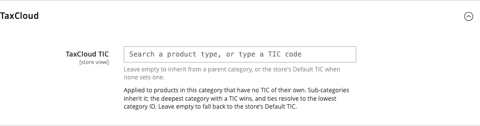
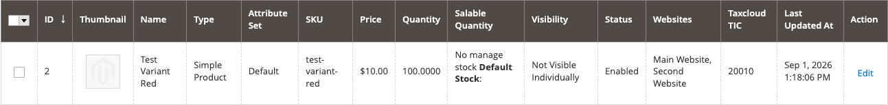

# Assigning TICs

Where to set a [TIC](tics.md), how to set many at once, and how the extension
decides which one applies to a given line on an order.

## Which TIC is used for an item

For each line, the first of these that has a value wins:

1. The **product's** own TaxCloud TIC.
2. The TIC on the nearest **category** above it.
3. The store's **Default TIC** setting.

Category lookup includes every category the product is assigned to *and all of
their parents*, so a TIC on `Grocery` covers `Grocery → Snacks → Chips` without
tagging every level. When more than one category in that set carries a TIC:

- The **deepest** category wins — `Grocery → Snacks` beats `Grocery`.
- If two are equally deep, the one with the **lowest category ID** wins.

A TIC on a store's root category is ignored. Use the **Default TIC** setting for
a store-wide value.

!!! note "Configurable products"
    The TIC comes from the variant the customer actually bought. Variants are
    usually not assigned to categories themselves, so if the variant has neither
    its own TIC nor a category with one, the parent product's categories are
    used before falling back to the Default TIC.

If you set no category TICs at all, products fall straight from their own TIC to
the Default TIC and no category lookup happens.

## Setting the store default

*Stores → Configuration → Sales → Tax →* **TaxCloud Settings** → **Default TIC**

Set this to whatever describes the bulk of your catalogue. For most stores that
is `00000`, general goods and services. For a clothing store it is worth setting
the clothing TIC here and overriding the exceptions instead — fewer products to
tag, and new products get sensible treatment automatically.

## Setting a TIC on a category

*Catalog → Categories →* select a category *→* **TaxCloud**

This is the efficient way to do it. One value covers every product in the
category and everything beneath it.

The field is store-view scoped: switch the store view at the top left, clear
**Use Default Value**, and a single category can carry a different TIC in
different stores.

## Setting a TIC on a product

*Catalog → Products →* edit a product

There are two fields that matter.

**Taxcloud TIC** — the code for this product. Leave it empty to inherit from a
category or the store default.

**Tax Class** — leave this as `Taxable Goods` for essentially everything.

!!! warning "Do not use Tax Class `None` to make a product tax-free"
    A product with tax class `None` is never sent to TaxCloud. It will not be
    taxed, but it also leaves no record of the sale in your TaxCloud account,
    so it cannot appear in a filing and gives you no audit trail. If a product
    is exempt, say so with the correct TIC and leave the tax class alone.

## Setting TICs on many products at once

*Catalog → Products*

The product grid has a **Taxcloud TIC** column, so you can sort and filter by it
— which is also how you find products that still have none.

To set a batch:

1. Tick the products you want to change.
2. *Actions → Update attributes*.
3. Find the **Taxcloud TIC** field, tick the **Change** checkbox below it.
4. Enter the TIC and save.

## The TIC field itself

Every TIC field in the admin behaves the same way. Start typing what you sell
and it searches TaxCloud's code list, showing each match with its description. A
code already saved is displayed with its meaning, so you can tell at a glance
whether it is the one you meant.

The field stays free text. A code TaxCloud does not recognise is saved exactly
as you entered it and saving is never blocked — which is convenient when
TaxCloud publishes a new code before the list is refreshed, and a trap if you
mistype. Check the description appears next to the value after saving.

## After changing a TIC

Tax lookups are cached, so a price you check immediately after a change may be
the old one. Flush the TaxCloud cache to see the effect right away — see
[Clearing the TaxCloud cache](clearing-the-cache.md).
