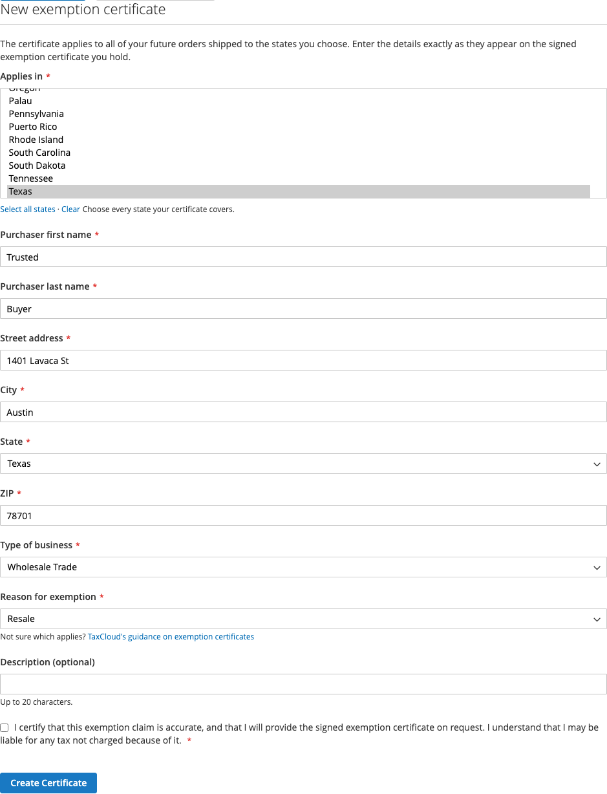

# What the customer sees

With [exemptions enabled](exemptions-setup.md), signed-in customers get a
**Tax Exemption Certificates** section in My Account.

What they can do there depends on whether you have let their customer group
manage certificates themselves — see
[Letting trusted customers manage certificates](exemptions-setup.md#letting-trusted-customers-manage-certificates).

## What is on the page

A list of the certificates held for them:

| Column | What it shows |
|---|---|
| Applies in | The states the certificate covers |
| Issued to | The purchaser named on it |
| Reason | Why the exemption is claimed |
| In use | Which certificate applies to their orders |
| Actions | Remove |

## What every customer can do

**Review their certificates.** Which states they are covered in, on what
grounds, and which certificate is in use. This is useful for a business customer
who wants to confirm you have their paperwork before placing a large order.

**Remove one that is no longer valid.** If a certificate has lapsed or an
organisation has changed, the customer can remove it themselves. Removing the
certificate in use also stops it applying.

!!! warning "Removing from My Account is permanent"
    It is the same deletion as in the admin — TaxCloud cannot restore it. A
    customer who removes the certificate in use will start being charged tax
    until another certificate is in use.

## What customers in a trusted group can also do

If the customer's group is one you have nominated, they also get:

**Add Certificate.** A form with the same fields as the admin one — the states
it covers, the purchaser's name and address, type of business, reason for
exemption and an optional description. The purchaser details start from the
customer's default billing address, and every field can be changed.

Before submitting, the customer must tick a box certifying that the claim is
accurate, that they will provide the signed certificate on request, and that
they may be liable for tax not charged because of it.

If the customer has no certificate in use, the new one is put in use straight
away. If they already have one in use, that one stays in use and the new one is
listed beside it.

**Use this certificate / Stop using.** The customer chooses which of their
certificates is in use, or stops using any.

**Refresh from TaxCloud.** Re-reads their certificates, for a change made in
the TaxCloud dashboard that has not appeared yet.

Every add and every change to the certificate in use is recorded in the
[TaxCloud log](logs.md) as made by the customer, so you can tell it from a
change an administrator made.

## What a customer cannot do

**Create or choose a certificate, unless their group is trusted.** For everyone
else, certificates are created and put in use by an administrator, from the
[admin panel](managing-certificates.md).

**See or change their TaxCloud Customer ID.** Only an administrator can.

**Pick a certificate at checkout.** The certificate in use is applied
automatically when it covers the destination state. There is no checkout step
where the customer picks one.

## Nothing changes at checkout

There is no extra checkout step and no "I am tax exempt" checkbox. If the
customer has a certificate in use covering the destination state, tax is not
charged. If they do not, it is.

That means an exempt customer can see tax on one order and not another — a
certificate covering New York does not exempt a shipment to Georgia. If a
customer asks why they were charged, [How an order becomes
exempt](how-an-order-becomes-exempt.md) has the checklist.

## Customers without exemptions

The section only appears for stores with exemptions enabled. A customer with no
certificates sees the section with a message saying there are none — nothing is
broken.
