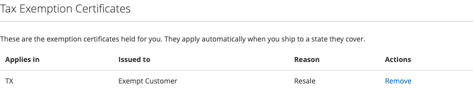

# What the customer sees

With [exemptions enabled](exemptions-setup.md), signed-in customers get a
**Tax Exemption Certificates** section in My Account.

## What is on the page

A list of the certificates held for them:

| Column | What it shows |
|---|---|
| Applies in | The states the certificate covers |
| Issued to | The purchaser named on it |
| Reason | Why the exemption is claimed |
| Actions | Delete |

## What a customer can do

**Review their certificates.** Which states they are covered in, and on what
grounds. This is useful for a business customer who wants to confirm you have
their paperwork before placing a large order.

**Delete one that is no longer valid.** If a certificate has lapsed or an
organisation has changed, the customer can remove it themselves.

!!! warning "Deleting from My Account is permanent too"
    It is the same deletion as in the admin — TaxCloud cannot restore it. A
    customer who deletes a certificate will start being charged tax, and you
    will need to file a new one to exempt them again.

## What a customer cannot do

**Create a certificate.** Certificates are created by an administrator, from the
[admin panel](managing-certificates.md). A customer cannot claim an exemption
for themselves.

**Choose which certificate applies.** The attached certificate is applied
automatically when it covers the destination state. There is no checkout step
where the customer picks one.

## Nothing changes at checkout

There is no extra checkout step and no "I am tax exempt" checkbox. If the
customer has an attached certificate covering the destination state, tax is not
charged. If they do not, it is.

That means an exempt customer can see tax on one order and not another — a
certificate covering New York does not exempt a shipment to Georgia. If a
customer asks why they were charged, [How an order becomes
exempt](how-an-order-becomes-exempt.md) has the checklist.

## Customers without exemptions

The section only appears for stores with exemptions enabled. A customer with no
certificates sees the section with a message saying there are none — nothing is
broken.
