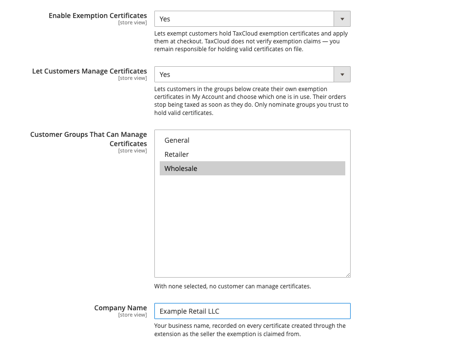
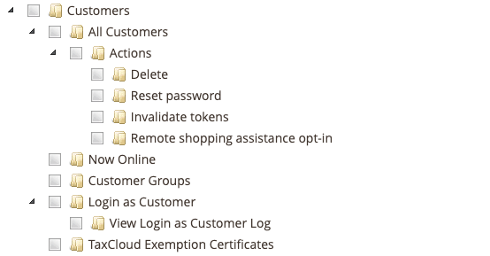
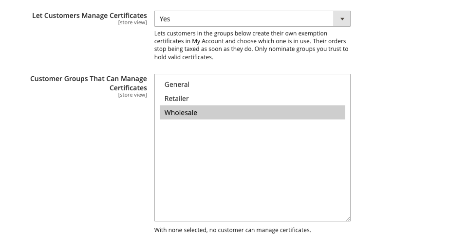

# Turning exemptions on

If you sell to resellers, schools, government buyers or non-profits, some of
your customers should not be charged sales tax. Exemption certificates are how
the extension knows which ones, and proves why.

The feature is off until you turn it on.

## What it gives you

With exemptions enabled:

- Customers can have TaxCloud exemption certificates held against their account,
  managed from the Magento admin — see
  [Managing certificates in the admin](managing-certificates.md).
- A certificate is applied automatically at checkout when it covers the
  destination state — see
  [How an order becomes exempt](how-an-order-becomes-exempt.md).
- Customers see their own certificates in My Account — see
  [What the customer sees](customer-account.md).
- Optionally, customers in groups you trust can add their own certificates and
  choose which one is in use — see
  [Letting trusted customers manage certificates](#letting-trusted-customers-manage-certificates).

Leaving it off changes nothing about how your store works today.

## Turning it on

*Stores → Configuration → Sales → Tax →* **TaxCloud Settings**

1. Set **Enable Exemption Certificates** to `Yes`.
2. Fill in **Company Name** — your legal business name. It is recorded on
   certificates created through the extension as the seller the exemption is
   claimed from, so it should match what is on your TaxCloud account.
3. Save.

## Decide who can manage certificates

Certificate management has its own admin permission, separate from ordinary
customer editing.

*System → Permissions → User Roles →* pick a role *→ Role Resources →*
**TaxCloud Exemption Certificates**

!!! warning "This permission is the ability to stop charging someone tax"
    It is deliberately separate from "can edit customers". Granting it lets
    someone attach a certificate that exempts a customer's orders entirely.
    Give it to the people who are accountable for your tax position, not to
    everyone who edits customer records.

## Letting trusted customers manage certificates

By default only an administrator can create a certificate or choose which one
is in use. If you have buyers you trust to keep their own paperwork — a
wholesale or reseller customer group, say — you can let them do it themselves
from My Account.

*Stores → Configuration → Sales → Tax →* **TaxCloud Settings**

1. Set **Let Customers Manage Certificates** to `Yes`.
2. In **Customer Groups That Can Manage Certificates**, select the groups you
   trust. With none selected, nobody can.
3. Save.

Customers in those groups can then add certificates, choose which certificate
is in use, and refresh their list — see
[What the customer sees](customer-account.md). Everyone else keeps the
read-only view.

!!! warning "A trusted customer can stop paying tax whenever they choose"
    A customer who adds a certificate for a state stops being charged tax there
    on their next order, with no one reviewing it first. They must confirm the
    claim is accurate before submitting, and every change is in the
    [TaxCloud log](logs.md), but you are still the one who must produce a valid
    signed certificate in an audit. Nominate only groups whose members you
    would trust to file their own paperwork, and collect the signed certificates.

Both settings are per store view. A customer in a nominated group can manage
certificates only on the stores where you nominated that group.

Taking a customer out of a nominated group, or turning the setting off, removes
the controls on their next page view. It does not undo anything: a certificate
they put in use stays in use until you change it on the
[admin panel](managing-certificates.md).

## What you are taking on

!!! warning "TaxCloud does not verify exemption claims"
    Nothing in TaxCloud or this extension checks that an exemption is genuine.
    If a state audits you, you are the one who must produce a valid signed
    certificate for every sale you did not charge tax on. Collect the paperwork
    before you attach the certificate, not after.

Practical consequences worth planning for:

- **Certificates expire and get revoked.** A certificate that was valid when you
  filed it may not be now. Review them periodically.
- **A certificate covers specific states.** One registered for New York does not
  exempt a shipment to Georgia. This is enforced automatically, so a customer
  can be exempt on one order and taxed on the next — that is correct behaviour,
  not a bug.
- **Single-purchase certificates are never applied automatically.** They cover
  one transaction, and the extension will not reuse one.

## Turning it off again

Set **Enable Exemption Certificates** back to `No`. The admin tab and the My
Account section disappear and no certificate is applied at checkout, so
previously exempt customers start being charged tax.

Nothing is deleted. The certificates remain in TaxCloud and the links between
them and your customers remain in Magento, so turning it back on restores the
previous behaviour.

Next: [Managing certificates in the admin](managing-certificates.md).
