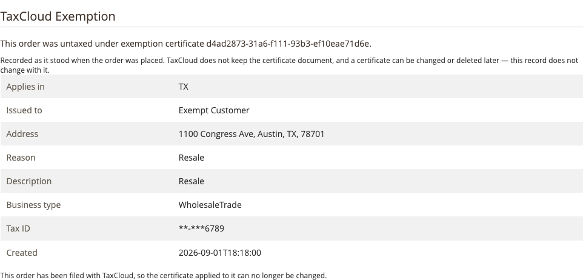

# How an order becomes exempt

There is no checkout step where a customer declares themselves exempt. The
extension works it out, and the rules are strict on purpose — an exemption
applied where it should not be is tax you owe.

## The conditions

All of these must be true, or the order is taxed:

1. **Exemption certificates are enabled** for the store the order is on.
2. **The customer is signed in.** A guest has no account to hold a certificate.
3. **A certificate is attached** to them — listed is not enough, it must be
   attached. See [Managing certificates](managing-certificates.md).
4. **The certificate covers the destination state.** One registered for New York
   does not exempt a shipment to Georgia.
5. **The certificate is usable** — not disabled, and not a single-purchase
   certificate.
6. **The certificate is filed under the customer's identity** — the one their
   **TaxCloud Customer ID** resolves to.
7. **TaxCloud can be reached** to confirm the certificates.

If any fails, tax is charged. That is the safe direction: an over-charged
customer can be refunded, whereas tax you failed to collect is money out of your
own pocket.

!!! note "Certificates that cannot be retrieved mean tax, not exemption"
    If TaxCloud cannot be reached when the extension asks for the customer's
    certificates, the order is taxed. The extension will not assume an
    exemption it could not confirm.

## Why a customer was charged anyway

Work down the list — these are the usual causes, most common first.

**They were not signed in.** The certificate is on the account; checking out as
a guest bypasses it.

**The certificate is listed but not attached.** Creating a certificate does not
apply it. Check the **In use** column in the admin panel.

**The state is not covered.** Compare the shipping address state against the
certificate's **Applies in** list.

**The TaxCloud Customer ID does not match.** If it has been changed, the
customer's certificates may be filed under a different identity. The admin panel
shows what the identity resolves to.

**It is a single-purchase certificate.** Those are never applied automatically.

**A change in TaxCloud has not propagated.** Certificates are cached for an
hour. If you created or enabled one in the TaxCloud dashboard, use **Refresh
from TaxCloud** in the admin panel, or [flush the TaxCloud
cache](clearing-the-cache.md).

**TaxCloud was unreachable.** Check [the log](logs.md) around the time of the
order.

## What is recorded on an exempt order

When a certificate is applied, the order keeps its own record: the certificate's
identifier, and a copy of what it said at the time of sale — who it was issued
to, which states, on what grounds.

That copy is the point. Certificates change and get deleted; the evidence for
why *this* order was not taxed does not, because it is stored with the order.

You can see it on the order view in the admin.

!!! warning "This is your audit trail, not your proof of entitlement"
    The record shows what the customer claimed and what you relied on. The
    signed certificate itself is still the document a state will ask for, and
    holding it is still your responsibility.

## Partial exemptions

An exemption applies to the order, not to individual lines. There is no
mechanism for exempting some products and taxing others on the same order for
the same customer. Product-level taxability is expressed through
[TICs](tics.md), which is a different question from who the buyer is.
