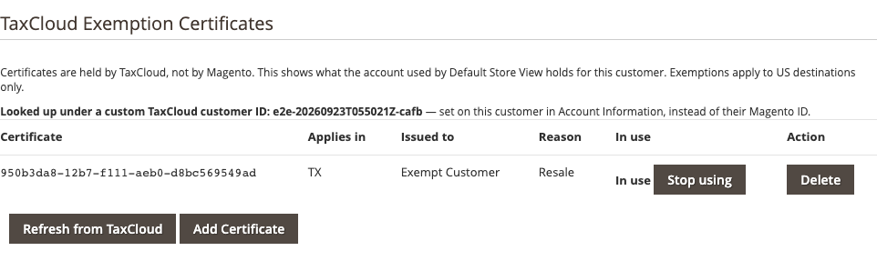
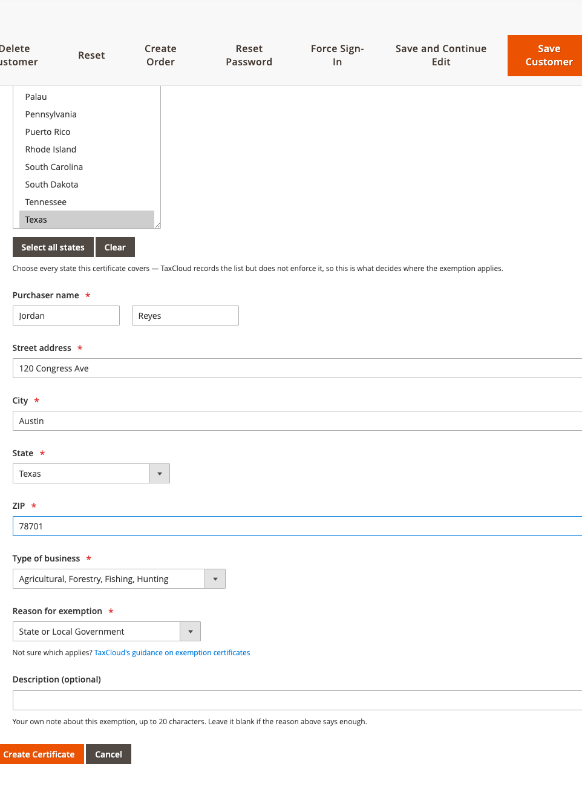

# Managing certificates in the admin

Once [exemptions are enabled](exemptions-setup.md), every customer edit page
gains a **TaxCloud Exemption Certificates** tab. Everything you need to do with
a customer's certificates happens there — no copying identifiers out of the
TaxCloud portal by hand.

*Customers → All Customers →* edit a customer *→* **TaxCloud Exemption
Certificates**

If you cannot see the tab, either exemptions are off or your admin role does not
have the permission — see [Turning exemptions on](exemptions-setup.md).

## What the panel shows

Every certificate filed under this customer's TaxCloud identity:

| Column | What it tells you |
|---|---|
| Certificate | The certificate's identifier in TaxCloud |
| Applies in | The states it covers |
| Issued to | The purchaser named on it |
| Reason | Why the exemption is claimed — resale, government, education, and so on |
| In use | Whether this is the certificate attached to the customer, with the button to attach or detach it |

The panel also shows which TaxCloud identity the customer resolves to, which is
worth a glance when something is not behaving: a certificate filed under a
different identity is invisible to this customer at checkout.

## Attaching a certificate

Listing a certificate does not exempt anything. **Attaching** it does — the
attached certificate is the one applied at checkout.

Click **Use for this customer** in the certificate's row. The **In use** column
then marks it, with a **Stop using** button to detach it again. A customer has
one attached certificate at a time; attaching another replaces it.

A certificate that TaxCloud has disabled shows *disabled* instead of a button —
it could never exempt anything, so it is not offered.

## Creating a certificate

Click **Add Certificate**.

| Field | What to enter |
|---|---|
| Applies in | The states the certificate covers. There are buttons to select all states or clear the selection. |
| Purchaser name | The person named on the signed certificate |
| Street address, City, State, ZIP | The purchaser's address |
| Type of business | What kind of organisation they are |
| Reason for exemption | Why they are exempt — resale, government, charitable, educational, and so on |
| Description | Optional free text, for a reason that needs explaining |

The form links out to TaxCloud's own guidance if you are unsure which reason
applies.

!!! warning "Enter what the signed certificate says"
    This form records a claim; it does not check one. The details should match
    the certificate the customer actually signed and that you are holding. If
    you do not have that document, get it before you create the record.

Creating a certificate files it with TaxCloud and lists it here. If the
customer has no certificate in use, the new one is put in use straight away;
otherwise the one in use stays, and you attach the new one when you want it to
take over.

## Refreshing from TaxCloud

**Refresh from TaxCloud** re-reads the customer's certificates.

Certificates are cached for an hour, so a certificate created or revoked
directly in the TaxCloud dashboard may not show here immediately. Changes made
through this panel appear straight away. Use Refresh when you have changed
something on the TaxCloud side and do not want to wait.

## Deleting a certificate

Click **Delete** in the certificate's row. Deleting the certificate in use also
stops it applying, so the customer is taxed from their next order until another
certificate is in use — the confirmation says so before anything happens.

!!! warning "Deletion is permanent"
    TaxCloud cannot restore a deleted certificate. If it was used on past
    orders, those orders keep their own record of what it said at the time —
    but the certificate itself is gone. Choose **Stop using** rather than delete
    if you only want to stop it being applied.

## Changes made by customers

If you have let a customer's group
[manage certificates](exemptions-setup.md#letting-trusted-customers-manage-certificates),
the customer may have added certificates or changed which one is in use from My
Account. They show here like any other. To see who made a change, look in the
[TaxCloud log](logs.md): administrators' changes carry their admin username, and
customers' changes read "customer *ID* (My Account)".

## The TaxCloud Customer ID

Each customer has a **TaxCloud Customer ID** — the identity their certificates
are filed under. It defaults to their Magento customer ID and normally needs no
attention.

Change it in one situation: several people buying under one organisation's
exemption. Point them all at the same TaxCloud Customer ID and they share that
organisation's certificates.

!!! note "Shared certificates can be removed by anyone sharing them"
    Every customer on a shared TaxCloud Customer ID can remove the shared
    certificates from My Account, which stops them applying for all of them.
    Each customer still has their own certificate in use, so one customer
    switching theirs does not affect the others.

!!! warning "Changing it changes which certificates a customer can use"
    Point a customer at a different identity and their existing certificates
    stop resolving — they will be taxed. Changes are recorded in the TaxCloud
    log, so you can see who changed what.

Next: [How an order becomes exempt](how-an-order-becomes-exempt.md).
