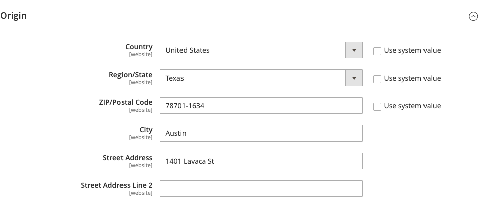
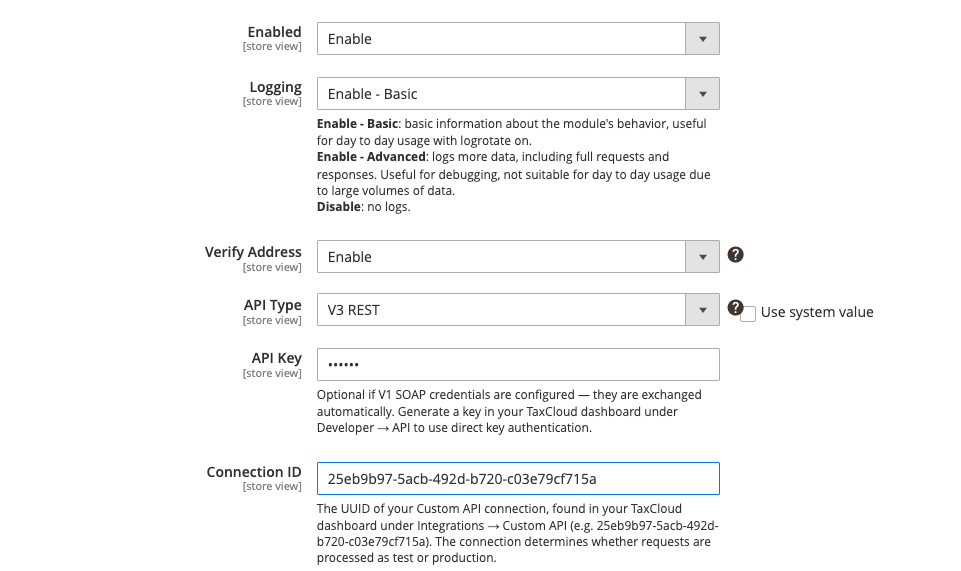

# Quick start

The shortest path from a freshly installed extension to a store charging correct
tax. Allow about twenty minutes, plus a test order.

You will need your TaxCloud credentials and your origin address — see
[Before you begin](before-you-begin.md) if you do not have them yet.

## 1. Set your origin address

*Stores → Configuration → Sales → Shipping Settings →* **Origin**

Enter the address you ship from, in full, including the **ZIP+4**.

This is where many setups go wrong. A five-digit ZIP can span more than one tax
jurisdiction, and a missing or malformed one stops the tax lookup happening at
all. Look yours up with the [USPS ZIP Code
lookup](https://tools.usps.com/zip-code-lookup.htm) if you are not sure.

Save the configuration.

## 2. Enter your credentials

*Stores → Configuration → Sales → Tax →* **TaxCloud Settings**

Leave **Enabled** set to `Disable` for now — you want credentials confirmed
before anything reaches your storefront.

Set **API Type**, then fill in the fields it reveals:

- **V3 REST** — paste your **Connection ID**. Leave **API Key** blank unless you
  generated one under *Developer → API* in TaxCloud.
- **V1 SOAP (legacy)** — enter your **API ID** and **API Key**.

Save the configuration.

## 3. Check the credentials work

Click **Test Connection**, on the **Verify Credentials** row.

A green confirmation means TaxCloud accepted them and you can carry on. Anything
else, fix it now — the rest of the setup will not work until this passes:

| What you see | What it means |
|---|---|
| TaxCloud rejected the credentials | The values are wrong. Re-copy them from your dashboard. |
| TaxCloud does not recognise the Connection ID | Right format, wrong connection — check *Integrations → Custom API*. |
| Could not reach TaxCloud | Not a credentials problem. Your server cannot get out to TaxCloud; ask your host about outbound HTTPS. |

## 4. Set your tax codes

Still in **TaxCloud Settings**:

**Default TIC** — what most of your catalogue is. Leave it at `00000` (general
goods and services) if you sell ordinary taxable items; change it if your
catalogue is mostly one special category, such as clothing or groceries. Start
typing what you sell and pick from the suggestions.

**Shipping TIC** — `11010` if you pass through postage only, `11000` if your
shipping charge includes handling.

A [TIC](tics.md) tells TaxCloud what kind of thing you are selling, which is
what decides how each state taxes it. These two are the fallbacks; individual
products can override them, which is step 7.

## 5. Turn it on

Set **Enabled** to `Enable` and save.

Your storefront is now calculating tax through TaxCloud.

!!! tip "Try it on one store view first"
    Every setting can be set per store view. If you run several stores, switch
    the **Store View** selector to one of them, enable TaxCloud there, and leave
    the others as they were until you are happy. See
    [Multi-store setups](multi-store.md).

## 6. Place a test order

Add something to the cart, check out to a real US address, and confirm the tax
looks right. Then complete the order and check it appears in your TaxCloud
dashboard with the right amount.

Full walkthrough, including refunds: [Testing your setup](testing-your-setup.md).

!!! note "Tax does not appear on the cart page at first"
    Until a shopper has entered a shipping address, there is nothing to
    calculate tax from. Tax appears once they reach checkout and give an
    address.

## 7. Set TICs on your products

The Default TIC covers everything you have not been specific about. Anything
taxed differently — clothing, food, digital goods, prescription items — needs
its own code.

You do not have to do this product by product. A TIC set on a category applies
to everything in it, and the product grid lets you set many at once. See
[Assigning TICs](assigning-tics.md).

!!! warning "This is the step that decides whether your tax is right"
    Everything up to here just connects the plumbing. The TIC is what tells
    TaxCloud what you are selling. A store where every product is treated as
    general goods will over-collect on exempt items and under-collect on some
    special ones.

## 8. Before you go live

- [ ] Origin address entered with ZIP+4
- [ ] Credentials verified
- [ ] Default TIC and Shipping TIC set
- [ ] TICs assigned to products and categories that need them
- [ ] A test order placed and checked against the TaxCloud dashboard
- [ ] A test refund checked against the TaxCloud dashboard
- [ ] Your TaxCloud connection switched from test to production, if you were
      using a test one
- [ ] Decided when orders should be reported —
      [Capture in TaxCloud](capture.md)
- [ ] Decided what happens if TaxCloud is unreachable —
      [Fallback to Magento Tax Rates](settings.md#fallback-to-magento-tax-rates)

## What next

- Sell to tax-exempt customers → [Turning exemptions on](exemptions-setup.md)
- Want the detail on any setting → [Settings reference](settings.md)
- Something is not right → [Common problems](common-problems.md)
