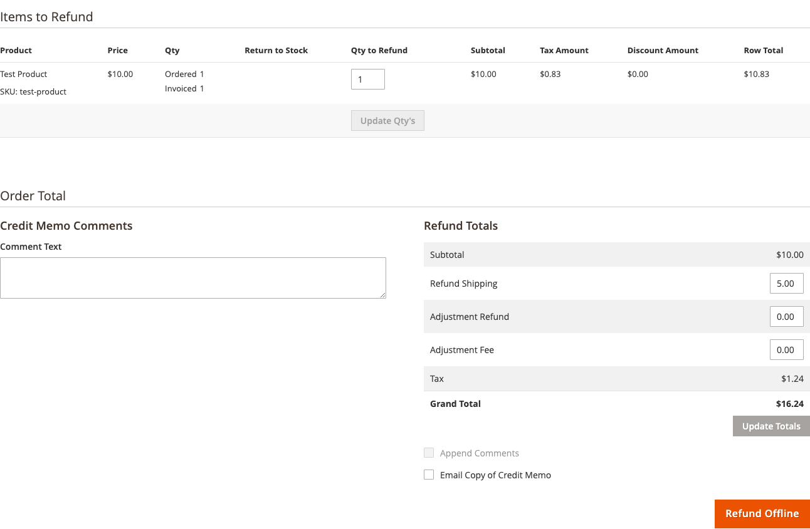

# Refunds and credit memos

When you refund an order, the tax has to come back out of what you will remit.
Creating a credit memo in Magento does that automatically — the refund is
reported to TaxCloud, which reduces what is filed.

## How it works

Issue a credit memo the way you always do: *Sales → Orders →* open the order
*→ Credit Memo*.

When it is refunded, the extension reports the reversal to TaxCloud
automatically. Nothing extra to click.

Both **full and partial refunds** are supported. Refund three of five items and
only those three are reversed; the rest stay reported as sold.

## What is included

**Products.** Every item on the credit memo, at the price actually paid —
discounts and promotions accounted for.

**Shipping**, if you are refunding it. Refund the goods but keep the shipping
charge and the shipping line stays reported as a sale, which is correct: you
kept that money and you owe tax on it if it was taxed.

## Checking it worked

Compare the credit memo in Magento against the transaction in your TaxCloud
dashboard. The amounts should match exactly. Percentages may look slightly
different because of rounding; the amounts should not.

If the reversal failed it is in [the log](logs.md). A failed reversal does not
block the refund — your customer gets their money — but TaxCloud still shows the
full sale, so it would be over-filed until you sort it out.

## Refunding an order from before an API switch

This is the one case that catches people out.

An order captured on one API cannot be refunded through the other. If you have
moved a store from V1 SOAP to V3 REST, an order placed before the switch is not
found by the new API, and its reversal fails.

**The fix:** set **API Type** back temporarily, issue the credit memo, then set
it forward again. Since the setting is per store view, this does not disturb your
other stores. See [Choosing your API](choosing-your-api.md).

## Refunds without a credit memo

If you refund a customer outside Magento — through your payment provider's
dashboard, or by sending them money directly — the extension knows nothing about
it. TaxCloud keeps the full sale and you over-file.

!!! warning "Always issue the credit memo in Magento"
    Even for a refund you processed elsewhere, record it as a credit memo so the
    tax reversal reaches TaxCloud. Magento supports an offline credit memo for
    exactly this.

## Orders that were never captured

If an order was never reported to TaxCloud — because of
[calculations-only mode](settings.md#only-do-tax-calculations-without-further-taxcloud-integration),
a failed capture, or a capture trigger it never reached — there is nothing to
reverse, and the reversal will not find it. Check whether the order is in your
TaxCloud dashboard at all before chasing a failed refund.

## Cancelling instead of refunding

An order cancelled before it was ever invoiced is handled differently — see
[Cancellations](cancellations.md).
