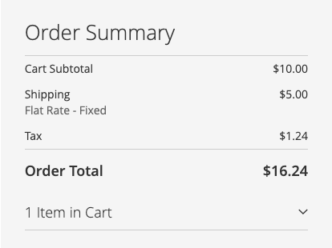
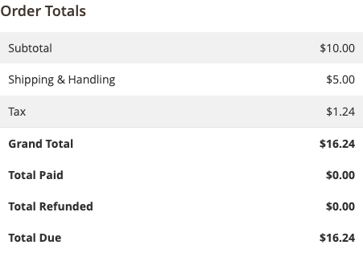

# Testing your setup

Before you rely on this for real money, prove it works. The extension is tested
against stock Magento, but your store is not stock Magento — other extensions
can interfere with checkout, totals and order flow.

Do this on a staging store if you have one. If you must do it on production, use
a test connection in TaxCloud so the transactions are not filed.

## 1. Tax at checkout

Add something to the cart, go to checkout, enter a real US shipping address, and
pick a shipping method.

Check:

- [ ] Tax appears in the totals
- [ ] The amount looks right for that address
- [ ] Shipping is taxed, or not, as you expect for that state

Repeat for **each kind of product you sell** — every distinct TIC, and a mixed
cart. This is where a wrong TIC shows up, and the only way to find it is to try
it.

Try a few destinations: your own state, a state with different rules, and a
state you do not collect in (which should produce no tax).

!!! note "No tax on the cart page before checkout is normal"
    There is no address to calculate against yet.

## 2. A completed order

Place the order, then open it in *Sales → Orders* and in your TaxCloud
dashboard.

<!-- The TaxCloud dashboard side of this comparison cannot be generated from the
     E2E store — it lives in a TaxCloud account. Supply it by hand if wanted. -->

Check:

- [ ] The order is in TaxCloud
- [ ] The **tax amounts match exactly** (percentages may differ slightly —
      rounding)
- [ ] The right TICs, quantities and prices are on each line
- [ ] The shipping line is there with the right TIC

If the order is not in TaxCloud at all, check your
[capture trigger](capture.md) — with *On payment* it will not appear until you
invoice it.

## 3. A refund

Create a credit memo — a **partial** one, which exercises more than a full
refund.

Check:

- [ ] The refund appears in TaxCloud
- [ ] Only the refunded items are reversed
- [ ] Shipping is reversed only if you refunded it
- [ ] The amounts match

Then try a full refund on another order.

## 4. A cancellation

Place an order with an offline payment method, leave it uninvoiced, and cancel
it.

Check:

- [ ] The sale is reversed in TaxCloud, or was never reported, depending on your
      capture trigger
- [ ] Nothing is left showing as a completed sale

## 5. Exemptions, if you use them

With [exemptions on](exemptions-setup.md), attach a certificate to a test
customer and order as them.

Check:

- [ ] Signed in, shipping to a covered state → no tax
- [ ] Signed in, shipping to a state the certificate does not cover → tax
- [ ] As a guest → tax
- [ ] The exempt order records the certificate on the order view

The second and third are as important as the first: they prove the exemption is
being applied deliberately rather than tax simply being broken.

## 6. Failure behaviour

Worth knowing before it happens for real rather than after.

Set **API Timeout** to `1` temporarily and place an order. Depending on
[fallback](settings.md#fallback-to-magento-tax-rates) you should see either no
tax or Magento's own rate — and an error in [the log](logs.md).

Put the timeout back afterwards.

## 7. Check the log

[Reading the log](logs.md) — look through what your testing produced. Warnings
you can explain are fine. Warnings you cannot are worth understanding now.

## Before switching to production

- [ ] Every check above passes
- [ ] Test transactions cleaned up or accounted for in TaxCloud
- [ ] The store switched from a test to a production connection
- [ ] **Cache Lifetime** back to `86400` if you set it to `0`
- [ ] **Logging** back to `Enable - Basic` if you set it to Advanced
- [ ] **API Timeout** back to its normal value
